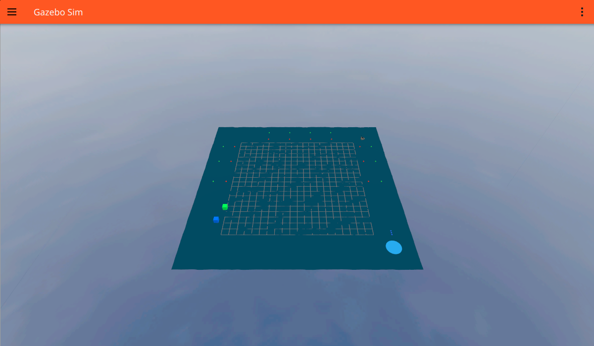
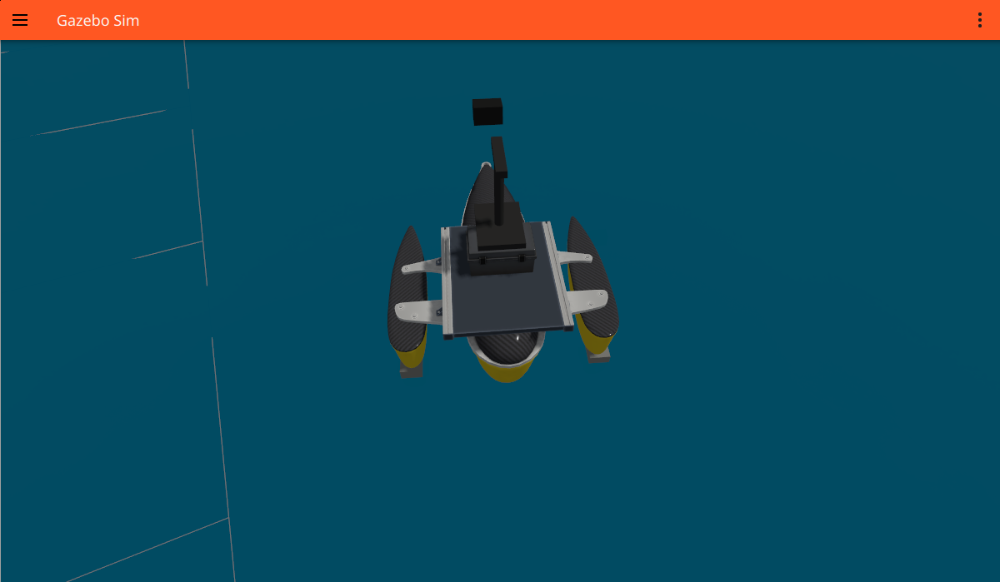
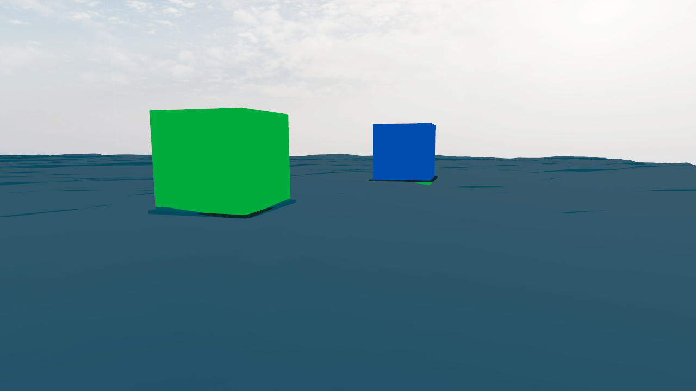

# Simulasi ASV KKI 2026

Workspace ini adalah simulasi kapal tanpa awak atau *Autonomous Surface Vehicle* (ASV) untuk latihan misi KKI 2026. Kapal berlayar di lingkungan laut virtual, melewati gerbang pelampung merah-hijau, mengenali target dengan kamera, menghindari rintangan, dan menyelesaikan misi di area docking.

*Lintasan A yang dijalankan langsung di Gazebo Sim. Pelampung membentuk jalur misi mengelilingi area perairan.*

## Kapal yang Disimulasikan

Model ASV menggunakan bentuk katamaran dengan dua pendorong, kemudi, LiDAR, GPS, IMU, kamera depan, dan kamera bawah. Kapal dapat dikendalikan secara manual maupun menjalankan misi secara otonom.

*Tampilan dekat model kapal ketika simulasi berjalan.*

## Misi di Dalam Workspace

Simulasi menyediakan dua lintasan, A dan B, dengan susunan yang saling dicerminkan. Kapal ditugaskan untuk:

- berlayar melewati gerbang pelampung tanpa tabrakan;
- memetakan lingkungan dan memilih jalur yang aman;
- menemukan serta memotret target di permukaan dan bawah air;
- kembali menuju area docking untuk mengakhiri misi.

*Foto target permukaan yang diambil otomatis oleh kamera depan kapal pada sesi simulasi Lintasan A.*

Gambar-gambar di atas berasal dari simulasi yang benar-benar dijalankan pada workspace ini, bukan ilustrasi buatan.

Rincian instalasi, cara menjalankan, struktur paket, topik ROS 2, dan panduan pengujian dipisahkan ke [DOKUMENTASI_TEKNIS.md](DOKUMENTASI_TEKNIS.md).
