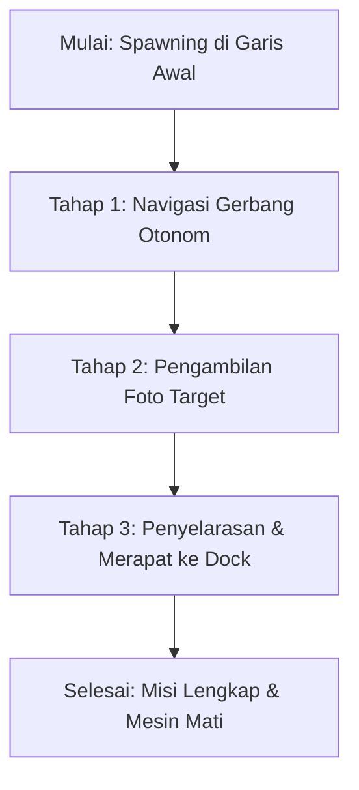

# Penjelasan Misi Kontes Kapal Cepat Tak Berawak (KKI) 2026 - Kategori Autonomous ASV

File ini menjelaskan detail misi, aturan navigasi, serta target pembuktian kamera yang harus diselesaikan oleh Kapal ASV otonom pada simulasi KKI 2026 (Lintasan A dan Lintasan B).

---

## 1. Misi Utama (Main Objectives)

Misi ASV dibagi menjadi tiga tahapan berurutan yang harus diselesaikan secara otonom tanpa intervensi manual:



### Tahap 1: Navigasi Gerbang Otonom (Gate Navigation)
* **Tujuan**: Kapal harus melewati 10 gerbang berurutan yang dibatasi oleh sepasang bola apung (buoys).
* **Aturan Warna**:
  * **Bola Apung Hijau**: Harus berada di sebelah kiri kapal (Lambung Kiri / *Port side*).
  * **Bola Apung Merah**: Harus berada di sebelah kanan kapal (Lambung Kanan / *Starboard side*).
* **Aturan Tabrakan**: Kapal tidak boleh menabrak bola apung gerbang di sepanjang lintasan (rintangan kuning telah dihapus).


### Tahap 2: Pengambilan Foto Target (Target Photography)
Kapal harus mendekati dua buah kotak target yang diposisikan di dekat tikungan lintasan, lalu mengambil foto bukti menggunakan kamera onboard:

1. **Target 1: Kotak Permukaan (Surface Target)**
   * **Visual**: Berwarna **Hijau** di atas permukaan air.
   * **Metode**: Difoto menggunakan **Kamera Depan (Kamera Atas Air)** saat kapal melintas di dekat koordinat target.
2. **Target 2: Kotak Bawah Air (Underwater Target)**
   * **Visual**: Berwarna **Biru** di atas air, namun bagian bawahnya berwarna **Hijau** di bawah air.
   * **Metode**: Difoto menggunakan **Kamera Bawah (Kamera Bawah Air)** yang diarahkan ke samping kanan kapal untuk menangkap gradasi warna hijau kotak di bawah air.

### Tahap 3: Merapat ke Docking Station (Docking Contact)
* **Tujuan**: Di akhir lintasan, kapal harus mengurangi kecepatan, menyelaraskan posisinya sejajar dengan stasiun docking, dan merapat ke dalam gerbang docking.
* **Kriteria Sukses**: Kapal melakukan kontak fisik dengan ketiga bola apung biru docking (`docking_*_blue_*`) secara bersamaan dan sistem navigasi menyatakan lintasan selesai (`track_complete=True`), yang ditandai dengan matinya gaya dorong kedua motor thruster kapal (`0.0N`).

---

## 2. Koordinat Target Misi (Lintasan A vs. Lintasan B)

Posisi koordinat target pada kedua lintasan dicerminkan (mirrored) pada sumbu X:

| Parameter Misi | Lintasan A (Course A) | Lintasan B (Course B) |
|---|---|---|
| **Titik Spawn Awal** | `x = 10.8, y = -8.7, yaw = 1.2405` | `x = -10.8, y = -8.7, yaw = 1.9011` |
| **Foto Target Permukaan** | `(-10.20, -5.40)` | `(10.20, -5.40)` |
| **Foto Target Bawah Air** | `(-11.00, -7.70)` | `(11.00, -7.70)` |
| **Zona Kontak Docking** | `x = 12.35, y = -9.7` | `x = -12.35, y = -9.7` |

---

## 3. Verifikasi Keberhasilan Misi

Misi dinyatakan selesai secara sempurna jika topik `/asv/mission/status` mempublikasikan string status berikut:

```text
mission_complete=True
```

Yang membutuhkan pemenuhan empat syarat mutlak berikut:
- [x] **`track_complete=True`** — Semua waypoint navigasi telah dilewati dan stasiun docking tercapai.
- [x] **`surface_photo = yes`** — Gambar bukti target permukaan beresolusi 1280x720 tersimpan di folder `mission_captures/`.
- [x] **`underwater_photo = yes`** — Gambar bukti target bawah air beresolusi 640x480 tersimpan di folder `mission_captures/`.
- [x] **`docking_touched >= 1`** — Kapal berhasil menyentuh bola apung biru docking.
